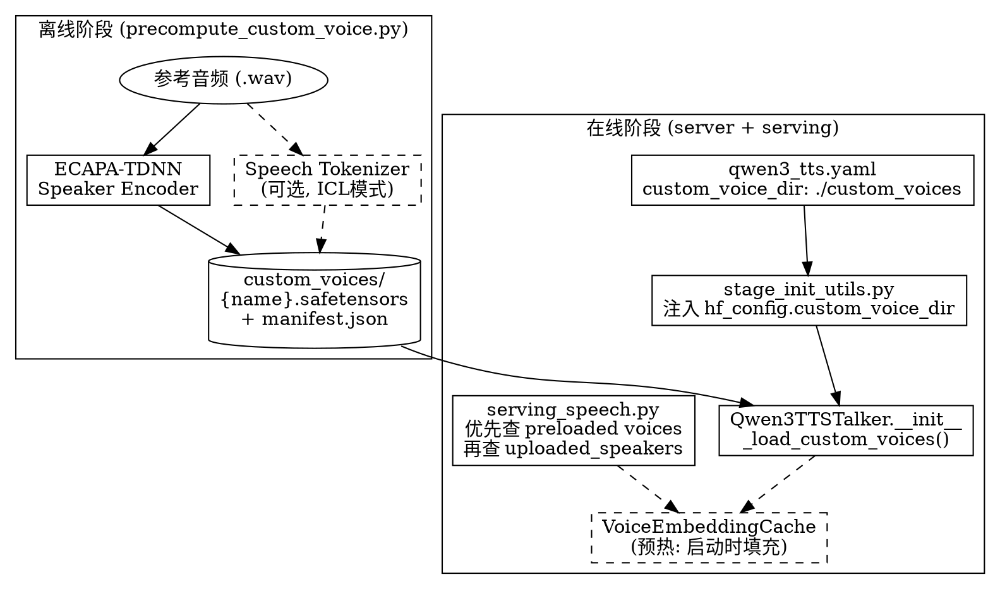

# Qwen3-TTS 持久化自定义音色技术方案

## 1. 问题分析

当前 Qwen3-TTS 的自定义音色存在以下局限：

| 问题 | 现状 |
|------|------|
| **上传音色不持久化** | `POST /v1/audio/voices` 上传的元数据仅存于内存 `uploaded_speakers` dict，重启丢失 |
| **磁盘文件被孤立** | 上传的音频/embedding 文件默认落盘到 `/tmp/voice_samples`，但启动时不回读 |
| **每次请求有开销** | 音频上传方式：每次请求需要 base64 编码参考音频 + 模型侧实时提取 speaker embedding |
| **无离线预计算** | 没有像 VoxCPM2 `precompute_custom_voice.py` 那样的离线工具 |

### 核心矛盾

`serving_speech.py:233-237` 明确标注了设计意图：

```python
self.uploaded_speakers: dict[str, dict] = {}
logger.warning(
    "Uploaded voices are ephemeral and will be lost on server restart. "
    "Re-upload voices after each restart if needed."
)
```

VoxCPM2 已经拥有完整的 `custom_voice_dir` 持久化机制（manifest + precomputed safetensors），本方案将该模式推广到 Qwen3-TTS。

## 2. 方案概要

复用 VoxCPM2 已验证的架构模式，核心思路：



### 两种使用路径

```
路径 A (推荐): 离线预计算 → 配置 custom_voice_dir → 启动服务器 → voice="alice"
路径 B (保留):  运行时 POST upload → 内存态 → 重启后需重新上传
```

## 3. 详细设计

### 3.1 存储格式

#### `custom_voice_manifest.json`

```json
{
  "model": "Qwen3-TTS",
  "hidden_size": 2048,
  "voices": {
    "alice": {
      "file": "alice.safetensors",
      "mode": "xvec",
      "speaker_description": "warm female narrator",
      "ref_text": "The quick brown fox..."
    },
    "bob": {
      "file": "bob.safetensors",
      "mode": "icl",
      "speaker_description": "deep male voice"
    }
  }
}
```

字段说明：
- `mode`: `"xvec"` (仅 speaker embedding) 或 `"icl"` (含 ref_code，用于 in-context learning 模式)
- `hidden_size`: 模型 embedding 维度，用于校验（0.6B → 1024, 1.7B → 2048）

#### `{name}.safetensors`

xvec 模式（轻量，推荐默认）：
```
speaker_embedding:  shape=(2048,)  dtype=float32
```

ICL 模式（含 codec tokens，质量更高但文件更大）：
```
speaker_embedding:  shape=(2048,)   dtype=float32
ref_code:           shape=(N,)      dtype=int32 (或 long)
```

#### 目录布局

```
custom_voices/
├── custom_voice_manifest.json
├── alice.safetensors
├── bob.safetensors
└── carol.safetensors
```

### 3.2 配置传播 (已有基础设施，无需改动)

VoxCPM2 的 `custom_voice_dir` 传播路径已对 Qwen3-TTS 可用：

```
qwen3_tts.yaml  ← 添加一行 custom_voice_dir
    │
    ▼
stage_config.py:_build_extras()  (line 771-772)
  已将 deploy.custom_voice_dir → yaml_extras["custom_voice_dir"]
    │
    ▼
stage_init_utils.py:build_vllm_config()  (line 472-475)
  已遍历 ("custom_voice_dir",) → setattr(hf_config, attr, val)
    │
    ▼
Qwen3TTSTalker.__init__()
  self.config.custom_voice_dir  ← 直接可读
```

**`qwen3_tts.yaml` 仅需添加一行（可选，默认关闭）：**

```yaml
# 在文件任意顶层位置，例如 async_chunk 之后：
#custom_voice_dir: "./custom_voices_for_qwen3"
```

### 3.3 模型层改动 (`qwen3_tts_talker.py`)

#### 3.3.1 `__init__` 加载预计算音色

```python
# 在 Qwen3TTSTalkerForConditionalGeneration.__init__ 末尾添加

_cv_dir = getattr(self.config, "custom_voice_dir", None)
self._custom_voice_dir = _cv_dir
self._preloaded_speakers: dict[str, dict] = {}  # voice_name → {embedding, ref_code?}
if _cv_dir and os.path.isdir(_cv_dir):
    self._load_custom_voices()
```

#### 3.3.2 `_load_custom_voices()`

```python
def _load_custom_voices(self) -> None:
    """Load pre-computed speaker profiles from custom_voice_dir."""
    manifest_path = os.path.join(self._custom_voice_dir, "custom_voice_manifest.json")
    if not os.path.exists(manifest_path):
        logger.warning("custom_voice_dir set but manifest not found: %s", manifest_path)
        return

    with open(manifest_path) as f:
        manifest = json.load(f)

    # Validate hidden_size matches this model
    expected_dim = self.config.speaker_encoder_config.enc_dim
    manifest_dim = manifest.get("hidden_size")
    if manifest_dim and manifest_dim != expected_dim:
        raise ValueError(
            f"Manifest hidden_size {manifest_dim} != model enc_dim {expected_dim}. "
            f"Recompute voices for this model variant."
        )

    loaded = 0
    for name, info in manifest.get("voices", {}).items():
        st_path = os.path.join(self._custom_voice_dir, info["file"])
        if not os.path.exists(st_path):
            logger.warning("Custom voice file not found: %s", st_path)
            continue
        tensors = {}
        with safe_open(st_path, framework="pt") as f:
            for key in f.keys():
                tensors[key] = f.get_tensor(key)

        if "speaker_embedding" not in tensors:
            logger.warning("Missing speaker_embedding in %s, skipping", st_path)
            continue

        profile = {
            "speaker_embedding": tensors["speaker_embedding"],
            "mode": info.get("mode", "xvec"),
            "ref_text": info.get("ref_text"),
            "speaker_description": info.get("speaker_description"),
        }
        if "ref_code" in tensors:
            profile["ref_code"] = tensors["ref_code"]

        self._preloaded_speakers[name.lower()] = profile
        loaded += 1

    logger.info("Loaded %d custom voices from %s", loaded, self._custom_voice_dir)
```

#### 3.3.3 预热 VoiceEmbeddingCache（可选优化）

```python
# 加载完 _preloaded_speakers 后，立即将 embedding 注入 VoiceEmbeddingCache
# 避免首次请求时的 cache miss 提取开销
for name, profile in self._preloaded_speakers.items():
    key = self._voice_cache.make_cache_key(name, profile["mode"] == "xvec", 1)
    self._voice_cache.put(key, {
        "ref_spk_embedding": profile["speaker_embedding"],
        "ref_code": profile.get("ref_code"),
        "icl_mode": profile["mode"] == "icl",
    })
```

#### 3.3.4 `_build_prompt_embeds` 集成

在 `_build_prompt_embeds` 的 Base 分支中，当前逻辑是：

```python
if voice_clone_prompt is None:
    # 查 uploaded voices (via created_at cache key)
    ...
```

新增一条 fast path：如果 `voice_name` 在 `_preloaded_speakers` 中且此前未命中 uploaded cache，直接从 `_preloaded_speakers` 取出 embedding 使用。

```python
if voice_clone_prompt is None:
    _voice_name = str(_speaker_list[0]).lower()

    # Fast path: preloaded custom voice (persistent, from custom_voice_dir)
    if _voice_name in self._preloaded_speakers:
        preloaded = self._preloaded_speakers[_voice_name]
        voice_clone_prompt = {
            "ref_spk_embedding": preloaded["speaker_embedding"],
            "icl_mode": preloaded["mode"] == "icl",
        }
        if preloaded.get("ref_code") is not None:
            voice_clone_prompt["ref_code"] = preloaded["ref_code"]

    # Fallback: uploaded voice (ephemeral, via cache)
    if voice_clone_prompt is None:
        _voice_created_at = ...
        _voice_cache_key = ...
        ...
```

### 3.4 服务层改动 (`serving_speech.py`)

#### 3.4.1 启动时从 manifest 回读 uploaded speakers

`__init__` 中读取 `hf_config.custom_voice_dir`，如果存在 manifest，将其中的 voice 条目注册到 `self.uploaded_speakers`，使得 `GET /v1/audio/voices` 和 `voice="alice"` 都能直接工作：

```python
# 在 __init__ 末尾（uploaded_speakers 初始化之后）

_cv_dir = getattr(self.engine_client.model_config.hf_config, "custom_voice_dir", None)
if _cv_dir:
    manifest_path = os.path.join(_cv_dir, "custom_voice_manifest.json")
    if os.path.exists(manifest_path):
        with open(manifest_path) as f:
            manifest = json.load(f)
        for name, info in manifest.get("voices", {}).items():
            name_lower = name.lower()
            self.uploaded_speakers[name_lower] = {
                "name": name,
                "consent": "precomputed",
                "file_path": os.path.join(_cv_dir, info["file"]),
                "created_at": -1,  # sentinel: preloaded, not uploaded
                "mime_type": "application/x-safetensors",
                "file_size": 0,
                "ref_text": info.get("ref_text"),
                "speaker_description": info.get("speaker_description"),
                "embedding_source": "direct",
                "embedding_dim": manifest.get("hidden_size", 0),
            }
            self.supported_speakers.add(name_lower)
        logger.info("Loaded %d custom voices from manifest: %s", len(manifest["voices"]),
                     sorted(manifest["voices"].keys()))
```

#### 3.4.2 上传 API 自动持久化（可选）

`upload_voice()` 和 `upload_voice_embedding()` 成功后，如果 `custom_voice_dir` 已配置，自动将音频/embedding 写入该目录并更新 manifest。

注意：这个功能可以选做或延后。关键路径是离线预计算 + 启动加载，上传持久化作为锦上添花。

#### 3.4.3 `_build_tts_params` 调整

现有的 uploaded_speakers 逻辑已经能处理 preloaded voices（created_at != 0 判断走向不变）。只有 preloaded 的 voice（created_at = -1 sentinel）需要特殊处理：

```python
if request.voice.lower() in self.uploaded_speakers and request.ref_audio is None:
    speaker_info = self.uploaded_speakers[request.voice.lower()]
    if speaker_info.get("created_at") == -1:
        # Preloaded custom voice: extract embedding from safetensors
        embedding = self._get_uploaded_speaker_embedding(request.voice)
        if embedding is not None:
            request.speaker_embedding = embedding
            params["task_type"] = ["Base"]
            if speaker_info.get("ref_text"):
                params["ref_text"] = [speaker_info["ref_text"]]
                params["x_vector_only_mode"] = [False]
                params["voice_created_at"] = [-1]
            else:
                params["x_vector_only_mode"] = [True]
            logger.info("Using preloaded custom voice: %s", request.voice)
    else:
        # Existing uploaded_voice logic...
```

### 3.5 离线预计算工具 (`precompute_custom_voice.py`)

参考 VoxCPM2 的同名脚本，但针对 Qwen3-TTS 的特点：

```python
"""
Pre-compute Qwen3-TTS custom voice speaker embeddings for fast loading.

Usage:
    # Single voice (xvec mode, recommended default):
    python precompute_custom_voice.py \
        --model Qwen/Qwen3-TTS-12Hz-1.7B-Base \
        --voice-name alice \
        --ref-audio /path/to/alice_ref.wav \
        --output-dir ./custom_voices/

    # Single voice (ICL mode, better quality, needs ref_text):
    python precompute_custom_voice.py \
        --model Qwen/Qwen3-TTS-12Hz-1.7B-Base \
        --voice-name alice \
        --ref-audio /path/to/alice_ref.wav \
        --ref-text "Transcript of the reference audio." \
        --mode icl \
        --output-dir ./custom_voices/

    # Batch mode:
    python precompute_custom_voice.py \
        --model Qwen/Qwen3-TTS-12Hz-1.7B-Base \
        --manifest voices.json \
        --output-dir ./custom_voices/
"""
```

核心流程：
1. 加载 Qwen3-TTS Base 模型（仅 speaker_encoder + speech_tokenizer，不需要完整 talker）
2. 对每段参考音频：
   - Resample 到 24kHz
   - 计算 mel spectrogram
   - 通过 ECAPA-TDNN 提取 speaker embedding
   - (ICL 模式) 通过 SpeechTokenizer 编码为 codec tokens
3. 保存 `{voice_name}.safetensors` + 更新 `custom_voice_manifest.json`

### 3.6 模型加载策略

VoxCPM2 的 `precompute_custom_voice.py` 加载完整 TTS 模型（`VoxCPM.from_pretrained`），这对于离线预处理是可行的。对于 Qwen3-TTS：

- **最小加载方式**: 仅加载 `speaker_encoder` 权重 + `SpeechTokenizer`。这可以通过直接构造 `Qwen3TTSSpeakerEncoder` 并从 checkpoint 加载对应权重实现，无需启动完整的 vLLM 引擎。
- **简化加载方式（MVP）**: 使用 `Qwen3TTSTalkerForConditionalGeneration` 完整加载，复用现有的 `_extract_speaker_embedding()` 和 `_encode_ref_audio_to_code()` 方法。内存开销可接受（预计算是一次性离线操作）。

推荐 MVP 阶段使用简化加载方式，后续优化。

## 4. 实施步骤

### Phase 1: MVP（离线预计算 + 启动加载）

| 步骤 | 文件 | 改动类型 |
|------|------|----------|
| 1 | `examples/.../qwen3_tts/precompute_custom_voice.py` | **新建** — 离线预计算工具 |
| 2 | `vllm_omni/model_executor/models/qwen3_tts/qwen3_tts_talker.py` | **改动** — `__init__` 加 `_load_custom_voices()` |
| 3 | `vllm_omni/model_executor/models/qwen3_tts/qwen3_tts_talker.py` | **改动** — `_build_prompt_embeds` 加 preloaded fast path |
| 4 | `vllm_omni/entrypoints/openai/serving_speech.py` | **改动** — `__init__` 从 manifest 加载 voices |

### Phase 2: 增强（可选）

| 步骤 | 文件 | 改动类型 |
|------|------|----------|
| 5 | `serving_speech.py` | **改动** — upload/delete 自动同步 manifest |
| 6 | `qwen3_tts_talker.py` | **改动** — 启动时预热 VoiceEmbeddingCache |
| 7 | `vllm_omni/deploy/qwen3_tts.yaml` | **改动** — 取消注释并文档化 `custom_voice_dir` |

### Phase 3: 扩展（延后）

| 步骤 | 说明 |
|------|------|
| 8 | `_load_custom_voices()` 额外调用 `_encode_ref_audio_to_code` 预计算 ref_code，支持 ICL 预热 |
| 9 | 支持从 manifest 增量热加载（文件监控或 API 触发），无需重启 |

## 5. 对比：实施前后

| 维度 | 实施前 | 实施后 |
|------|--------|--------|
| **音色持久化** | 重启丢失，需 re-upload | manifest + safetensors 持久化，重启自动加载 |
| **首次请求延迟** | 实时提取 speaker embedding | 预热缓存，零提取开销 |
| **预计算工具** | 无 | `precompute_custom_voice.py` 支持单音色/批量 |
| **配置方式** | 仅 HTTP API 上传 | `custom_voice_dir` YAML 配置 + API 上传 |
| **与 VoxCPM2 一致** | 模式不同 | 模式统一 |
| **upload API 行为** | 内存态 | 可选持久化到 custom_voice_dir |
| **上传 API 兼容性** | 当前行为 | 完全兼容，保持不变 |

## 6. 关键设计决策

### 6.1 为什么不直接复用 `/tmp/voice_samples` 目录的文件来回读？

现有的 `/tmp` 文件缺少 metadata（`ref_text`、`consent`、`created_at` 等），且文件名包含时间戳，无法区分"上次启动时上传的"和"更早的孤儿文件"。引入 manifest 文件可以干净地解决这个问题。

### 6.2 为什么 speaker embedding 存在 model 层而不是 serving 层？

speaker embedding 是 GPU tensor，由 talker 的 ECAPA-TDNN 生成。模型层加载可以直接放到正确的 device/dtype 上。serving 层加载则需要序列化 → 传递 → 反序列化，增加复杂度。

两种路径并存：serving 层的 `_get_uploaded_speaker_embedding()` 从 safetensors 读取 float list → 通过 IPC 传到 talker → talker 转为 tensor。preloaded 路径直接在 talker 内部完成，跳过 IPC。

### 6.3 为什么要同时维护 serving 层的 uploaded_speakers 和模型层的 _preloaded_speakers？

- **serving 层** (`uploaded_speakers`): 负责 API 行为 — `GET /v1/audio/voices` 列出声色、`_build_tts_params` 做路由决策
- **模型层** (`_preloaded_speakers`): 负责张量生命周期 — embedding 在 GPU 上，与 talker 同生命周期

两个字典服务于不同目的，都轻量（仅是索引），不需要合并。

### 6.4 0.6B 和 1.7B 的兼容性

manifest 记录 `hidden_size` 用于校验。工具脚本从 `Qwen3TTSTalkerConfig` 自动读取当前模型的 `speaker_encoder_config.enc_dim`，保证保存的维度与模型匹配。加载时验证。

## 7. 用户使用流程

### 流程 A: 离线预计算 (推荐)

```bash
# 1. 预计算自定义音色
python examples/online_serving/text_to_speech/qwen3_tts/precompute_custom_voice.py \
    --model Qwen/Qwen3-TTS-12Hz-1.7B-Base \
    --voice-name alice \
    --ref-audio /path/to/alice_ref.wav \
    --output-dir ./custom_voices/

# 2. 在 qwen3_tts.yaml 中配置 (或启动时传入)
# custom_voice_dir: "./custom_voices"

# 3. 启动服务器
vllm serve Qwen/Qwen3-TTS-12Hz-1.7B-Base --omni --port 8091

# 4. 使用自定义音色 (无需 ref_audio!)
curl -X POST http://localhost:8091/v1/audio/speech \
    -H "Content-Type: application/json" \
    -d '{"input": "你好，世界", "voice": "alice", "response_format": "wav"}' \
    --output output.wav
```

### 流程 B: 批量预计算

```bash
# voices.json:
# [
#   {"name": "alice", "ref_audio": "/data/alice.wav", "ref_text": "..."},
#   {"name": "bob",   "ref_audio": "/data/bob.wav"}
# ]

python examples/online_serving/text_to_speech/qwen3_tts/precompute_custom_voice.py \
    --model Qwen/Qwen3-TTS-12Hz-1.7B-Base \
    --manifest voices.json \
    --output-dir ./custom_voices/
```

### 流程 B2: ICL 模式 (更高质量)

```bash
# ICL 模式保留 codec tokens，生成效果更自然
python examples/online_serving/text_to_speech/qwen3_tts/precompute_custom_voice.py \
    --model Qwen/Qwen3-TTS-12Hz-1.7B-Base \
    --voice-name alice \
    --ref-audio /path/to/alice_ref.wav \
    --ref-text "参考音频的准确文本转录" \
    --mode icl \
    --output-dir ./custom_voices/
```

### 流程 C: 运行时上传 + 自动持久化 (Phase 2)

```bash
# 上传 (与现在完全相同)
curl -X POST http://localhost:8091/v1/audio/voices \
    -F "audio_sample=@alice.wav" \
    -F "name=alice" \
    -F "consent=user_consent_id"

# 如果 custom_voice_dir 已配置，自动同步到 manifest
# 重启后 voice 仍可用
```

## 8. 文件变更清单

| 文件 | 操作 | 说明 |
|------|------|------|
| `examples/.../qwen3_tts/precompute_custom_voice.py` | **新建** | 离线预计算脚本 |
| `vllm_omni/model_executor/models/qwen3_tts/qwen3_tts_talker.py` | 改动 ~80 行 | `_load_custom_voices()`, `_preloaded_speakers`, `_build_prompt_embeds` 集成 |
| `vllm_omni/entrypoints/openai/serving_speech.py` | 改动 ~40 行 | `__init__` 加载 manifest → uploaded_speakers; `_build_tts_params` preloaded 分支 |
| `vllm_omni/deploy/qwen3_tts.yaml` | 改动 1 行 | 文档化 `custom_voice_dir` 字段（注释状态） |
| `docs/serving/speech_api.md` | 改动 ~10 行 | 文档更新 |
| `examples/.../qwen3_tts/README.md` | N/A | 如需可在 CUSTOM_VOICE_PLAN.md 引用 |

## 9. 风险与注意事项

1. **ICL 模式的 ref_code 依赖** — ref_code 长度取决于输入音频时长，变化较大。如果参考音频很长，safetensors 文件会变大（但通常仍然 << 1MB）
2. **manifest 并发写入** — Phase 2 的 upload 自动同步 manifest 需要加文件锁，避免多进程 race condition
3. **代码复用** — `_extract_speaker_embedding()` 和 `_normalize_ref_audio()` 是 talker 实例方法；离线脚本需要独立副本或通过依赖注入调用
4. **向后兼容** — `custom_voice_dir` 默认不设置，所有现有行为保持不变
