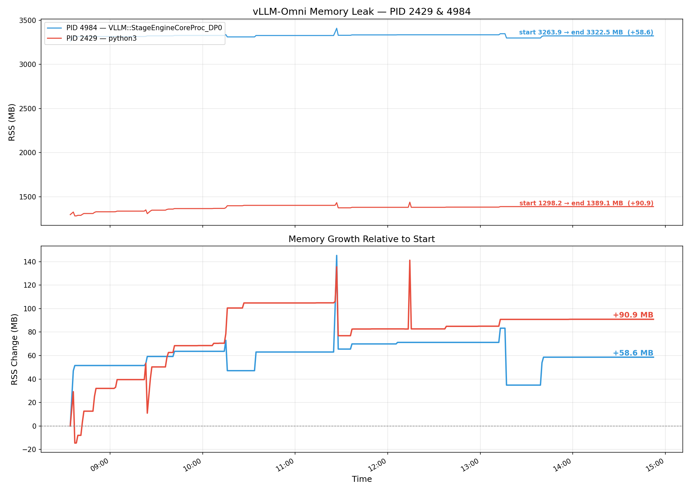
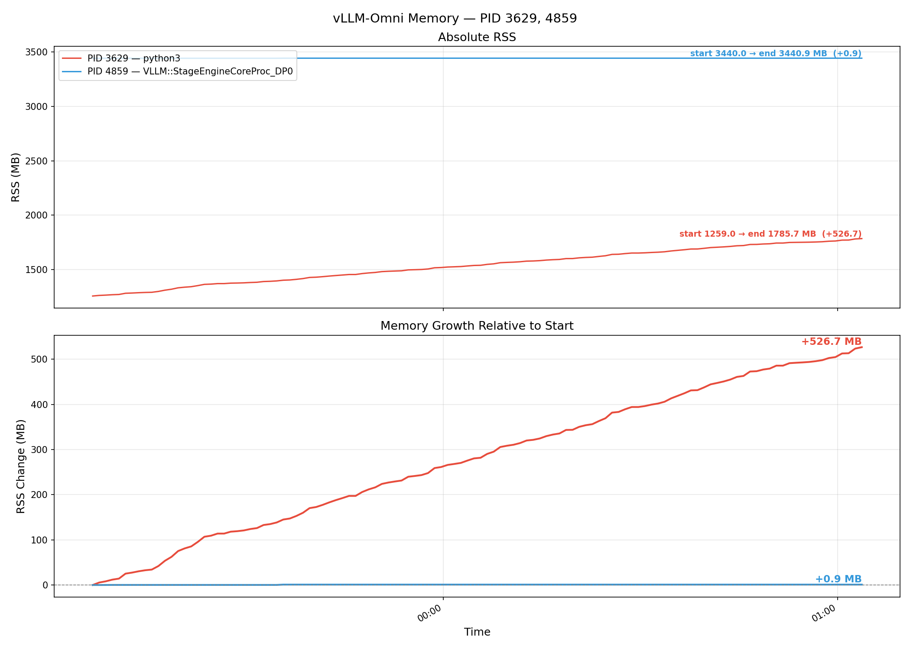
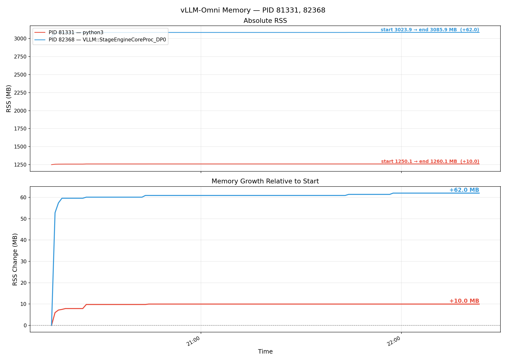

# VoxCPM2 客户端超时取消时的内存泄漏分析

## 背景

在 vLLM-Omni 服务压测 VoxCPM2 语音合成时，发现客户端超时取消请求会造成内存泄漏。

**常规压测**（无超时），压测 5 小时内存增长约 100MB：



**4 秒超时压测**，仅 2 小时内存就稳步增长了 500MB：



对比可知，客户端超时取消（CancelledError）是内存增长的触发条件。

## 根因

### 架构背景

一次请求在 vLLM-Omni 中经过两层独立的状态存储：

```
AsyncOmni
  → Orchestrator
      │
      ├── output_processors[stage_id]    ← Orchestrator 层（CPU 侧）
      │     └── OmniRequestState
      │           └── mm_accumulated      ← 累积的 CPU 推理产物
      │
      └── stage_clients[stage_id]        ← 跨进程 RPC
            → Engine Core 进程
                → scheduler
                    → model runner
                        → voxcpm2_talker  ← 模型层（GPU 侧）
                              └── _active_states
```

- **Orchestrator 层**：`MultimodalOutputProcessor` 持有 `OmniRequestState`，其中 `mm_accumulated` 按 step 累积推理产物。对 VoxCPM2，每个 decode step 产出一个音频 chunk，以 CPU float32 tensor 存储在 list 中。
- **模型层（Engine Core 进程）**：VoxCPM2 talker 的 `_active_states` 持有 GPU tensor（latent、embedding 等）。

### 正常完成路径

正常完成的请求通过 `process_outputs()` 链路清理 Orchestrator 层状态：

1. Engine Core 产生 `EngineCoreOutput`，`finish_reason=STOP`
2. Orchestrator `_process_stage_outputs()` → `processor.process_outputs(engine_core_outputs)`
3. `process_outputs()` 遍历输出，发现 `finish_reason` 不为 None
4. 基类 `_finish_request()` → `self.request_states.pop(req_id)` — **正确释放**

### Abort 路径的缺陷

Abort 的请求不会产生 `EngineCoreOutput`。其流程是：

1. `scheduler.finish_requests(request_ids, FINISHED_ABORTED)` → 放入 `finished_req_ids`
2. 下一次 `schedule()` 时放入 `scheduler_output.finished_req_ids`
3. model runner 调用 `on_requests_finished(finished_req_ids)` — 清理 GPU 侧状态 ✓
4. 放入 `EngineCoreOutputs.finished_requests` — 一个 set of request IDs

**Orchestrator 完全不处理 `finished_requests` 字段**（在 `orchestrator.py` 中搜索 `finished_requests` 结果为零）。`process_outputs()` 只遍历 `outputs` 列表，不处理 `finished_requests`。

同时，`Orchestrator._handle_abort()` 只做了两件事：
- 向 engine core 进程发送 abort（释放 GPU 显存）✓
- 清理 `self.request_states`（`OrchestratorRequestState`）✓

**缺失**：没有清理 `self.output_processors[stage_id]` 中的 `OmniRequestState`。

### 泄漏的具体表现

`OmniRequestState.mm_accumulated` 累积的是 VAE decoder 产出的 CPU audio tensor。对于 48kHz 音频，单次请求约几十步 decode，累积几 MB。如果 50 个被 abort 的请求同时存在，就是数百 MB 的 CPU 内存泄漏。

### 模型层的清理是正确的

VoxCPM2 talker 的 `_active_states`（GPU tensor）通过独立链路正确清理：

```
scheduler.finished_req_ids
  → gpu_ar_model_runner.py:326: on_requests_finished()
    → voxcpm2_talker.py:486: _deferred_cleanup_ids.add(req_id)
      → voxcpm2_talker.py:842: _flush_deferred_cleanup()
        → _active_states.pop(req_id)  ✓
```

`_deferred_cleanup_ids` 的延迟清理机制设计是正确的——engine core 进程内的 abort 链路会触发清理。**修复不需要触及这一层。**

## 修复

**文件**: `vllm_omni/engine/orchestrator.py:1085`

在 `_handle_abort` 的 stage 循环中，向 engine core 发送 abort 后，同步清理 Orchestrator 层 output processor 中的状态：

```python
async def _handle_abort(self, msg: dict[str, Any]) -> None:
    request_ids = msg["request_ids"]
    all_ids_to_abort = self._cfg_tracker.abort_parents(request_ids)
    for stage_id in range(self.num_stages):
        await self.stage_clients[stage_id].abort_requests_async(all_ids_to_abort)
        # Clean up OutputProcessor state (e.g. mm_accumulated tensors) that
        # would otherwise leak — normal completion cleans up via
        # process_outputs(), but aborted requests never produce an
        # EngineCoreOutput, so we must purge them explicitly.
        self.output_processors[stage_id].abort_requests(all_ids_to_abort, internal=True)
    for req_id in all_ids_to_abort:
        self.request_states.pop(req_id, None)
```

`abort_requests()` 通过 `request_states.pop(request_id)` 移除整个 `OmniRequestState` 对象，失去引用的 `mm_accumulated` 及其内部所有累积的 CPU tensor 随对象一起被 GC 回收。

## 效果对比

修复后使用相同的 4 秒超时压测条件，2 小时内存仅增长 60+MB，与无超时的正常压测水平基本一致：



| 场景 | 压测时长 | 内存增长 | 增长速率 |
|------|---------|---------|---------|
| 无超时（修复前） | 5h | ~100MB | ~20MB/h |
| 4s 超时（修复前） | 2h | ~500MB | ~250MB/h |
| 4s 超时（修复后） | 2h | ~60MB | ~30MB/h |

修复后的轻微增长（~30MB/h）属于 Python 进程正常的 RSS 波动和碎片化，与 CancelledError 路径的显式泄漏已不再相关。
